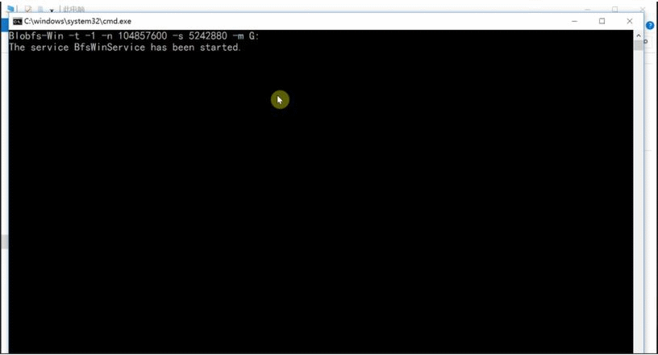
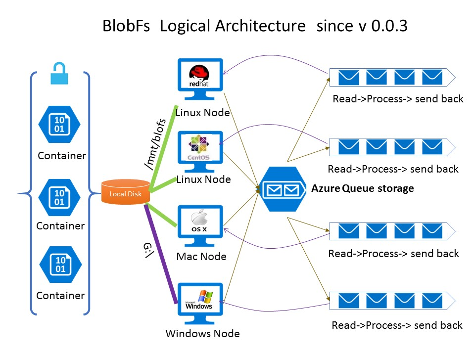

BlobFs-Win
=====

BlobFs is a distributed [FUSE](http://fuse.sourceforge.net) based file system backed by [Microsoft azure blob storage service](https://azure.microsoft.com/en-us/services/storage/blobs/). It allows you to mount the containers/blobs in the storage account as a the local folder/driver. , no matter it is a Linux system or a Windows system. It support the cluster mode. you can mount the blob container (or part of it) across multiple linux and windows nodes.

## Important Notes:
* Here is the windows version of the blobfs, please find the linux/mac version of the blobfs from [blobfs](https://github.com/wesley1975/blobfs).
* For the core libraries of the blobfs, you can find it from the [bloblib](https://github.com/wesley1975/bloblib). which is responsible for handling all the underlying azure blob storage operations
* If you are interested in contributing, please contact me via jie1975.wu@gmail.com

## Project Goals
Object storage is one of the most fundamental topic you'll encounter when you decide to start your cloud journey.The main goal of the project is to make azure storage service easy to use for Linux and windows box.

## Key Updates:
base on the lots of feedbacks, in version 0.0.3, I made these major updates:
* Ported the blobfs to windows platform. It became a universal solution. 
* Improve the performance of list/rename/delete operation by enabling the multi-threading way. now it can list/rename/delete the thousands of items within few seconds.
* By requests of many users, I changed the queue from service bus to the Azure Queue storage,This will greatly simplify the configuration.
* Various bugs fixed, It is now more stable. you can use in production environment, but it's at your own risk.

## Features:
* Implemented these winfsp functions: GetVolumeInfo,SetVolumeLabel, GetSecurityByName, GetFileInfo, open, Create, Read, Write, Cleanup, Close, SetBasicInfo, SetFileSize, CanDelete, Rename, Overwrite, ReadDirectoryEntry, GetDirInfoByName.
* Allow mount multiple containers (or part of them) as the local folder.
* Cluster enabled: It supports mount the same containers/blobs across multiple nodes. Theses files can be shared via these nodes. The caches of these nodes are synchronized via azure queue storage.
* Use blob leases as the distributed locking mechanism across multiple nodes. The blob will be locked exclusively when it is written. 
* File’s attribute is cached for better performance, the cache are synchronized via azure queue storage.
* The contents are pre-cached by chunks when there is read operation. This will eliminate the times of http request and increase the performance greatly. 
* Multi-part uploads are used for the write operation. Data is buffered firstly and then be uploaded if the buffer size exceed the threshold. This also can eliminate the times of http request and increase the performance greatly. 
* You can edit the file content on the fly, especially recommend for the small file, It does not need download, edit and then upload.
* Append mode is supported, you can append the new line to the existing blob directly. this is more friendly for logging operation.
* Use server-side copy for move, rename operations, more efficient for big files and folders.

## Architecture and introduction

This is the logical architecture of blobfs:

* Blobfs uses the blob leases to safe the write operation in the distributed environment, there is a dedicated thread to renew the lease automatically.
* For each of the node, there is local cache in it’s memory, the cache will store the file attributes. Once the file is changed by the node, the node will send a message to the Azure Queue storage. And then other nodes will receive the message and process it.

## installation
Installation now is very easy. But I strongly recommend to test and verify it in you environment before you use it. it's at your own risk.
### 1.Install WinFsp
    Download the winfsp-1.2.17298.msi from [WinFsp](https://github.com/billziss-gh/winfsp/releases).
	lanuch it and install with default configuration.
### 2.Install blobfs-win
#### 2.1 Download the blobfs-win released version.
#### 2.2 Edit configuration file: 
	Open blobfs.conf
	change the setting of :
    Storage_Connection_String = your-storage-account -connection-string
    blob_prefix = /  (e.g. /container1/folder1/)
    win_mount_point = Y:\ (make sure end with one slash)
    cluster_enabled = true
the cluster mode is enabled by default, You can also modify other settings if needed

### final.Start the blobfs service
    Edit the blobfs-win.bat and lanuch it
	
It is highly recommended that you should config it as a windows services.

## Tips
* the block blob is read only by default. marked with read only flag in the popup properties windows.
* the append blob is marked with the normal file without the read only flag in the popup properties windows.
* For container creation in windows UI, this will fail if your windows are non-english. this is by design from azure. you can use cli to create it, mkdir newcontainer

## How to create a append blob

* Programming way

	// java 1.7+
	FileWriter appendFile = new FileWriter("G:\\\\share\\\\append.log", true);
	
	appendFile.write("this is a append file");
	
	appendFile.close();
	
	
	// Python
	appendFile = open("G:\\\\container1\\\\append.log",' a+') 
	
	appendFile.write("this is a append file");
	
	appendFile.close();
	
	
	// C#
	System.IO.StreamWriter appendFile = File.AppendText("G:\\\\container1\\\\append.log")
	
	appendFile.WriteLine("this is a append file");
	
	
	...

## Performance Test
* The performance depends on the machine and the network. for the VMs within the same region with the blob service, The average bandwidth is 20 ~ 30MB/s

## Dependency
* [WinFsp](https://github.com/billziss-gh/winfsp): Great Windows File System Proxy - FUSE for Windows.
* [IKVM.NET](https://www.ikvm.net/): IKVM.NET is an implementation of Java for Mono and the Microsoft .NET Framework.

## Limitation and known issues:
* Due to the overhead of fuse system, the performance will be expected slower than native file system. 
* For the file copy, the blobfs will use read out - then write in to new blob mode. this will spent more time for large files/folders.
* For the page blob, currently, should be, but it is not well tested yet. it may casue file interruption. 
* In some cases for the desktop user, right-click these files (*.PPT(X), *.DOC(X)) may casue very slow response.
* In Windows UI, copy the folder with many small files will be very slow. you can zip it. use robocopy or other tools.

## Supported platforms
* Linux : [blobfs](https://github.com/wesley1975/blobfs)

* MacOS (via osxfuse): [blobfs](https://github.com/wesley1975/blobfs)

* windows: [blobfs-win](https://github.com/wesley1975/blobfs-win)

## Command Line Usage
	usage: Blobfs-Win OPTIONS

	options:
		-d DebugFlags       [-1: enable all debug logs]
		-D DebugLogFile     [file path; use - for stderr]
		-i                  [case insensitive file system]
		-t FileInfoTimeout  [millis]
		-n MaxFileNodes
		-s MaxFileSize      [bytes]
		-F FileSystemName
		-S RootSddl         [file rights: FA, etc; NO generic rights: GA, etc.]
		-u \Server\Share    [UNC prefix (single backslash)]
		-m MountPoint       [X:|* (required if no UNC prefix)]s

## License
	Copyright (C) 2017 Wesley Wu jie1975.wu@gmail.com
	This code is licensed under The General Public License version 3
	
## FeedBack
	Your feedbacks are highly appreciated! :)
